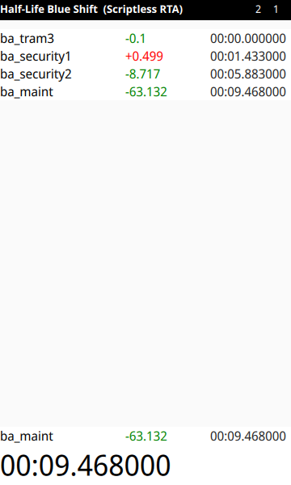

# Bunnysplit-qt
#### Bunnysplit-qt is a GUI timer with splits which serves exclusively as a front-end for BXT's BunnySplit on Linux.

## Screenshot of current state

## Motivation
* There was no existing "native" integration with BXT's BunnySplit, even though Steam runs can be done on the native Linux version of Half-Life and its expansions.

Q: *Why not just extend an RTA existing timer like urn/llainfair then?* 

Q: *Why not just extend LiveSplit One, or at least use livesplit-core then?*

A: Basically, this isn't trying to save the world of Steam Half-Life RTA Linux speedrunning (obviously, it will always be second class citizen) and be the best timer in the world, it was just an excuse to learn about something new, in this case `PySide6 (Qt)`, `QML`, `posixmq`, `dataclasses`, etc.

## Requirements
* ipcqueue
* PySide6
* JSONWizard

## TODO
- [ ] Best time
- [ ] Gold splits
- [x] ListView & ScrollView for splits in QML instead of Repeater
- [ ] General refactoring
- [ ] Graceful quitting (stopping Worker thread etc.), signal handling